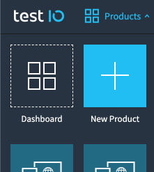
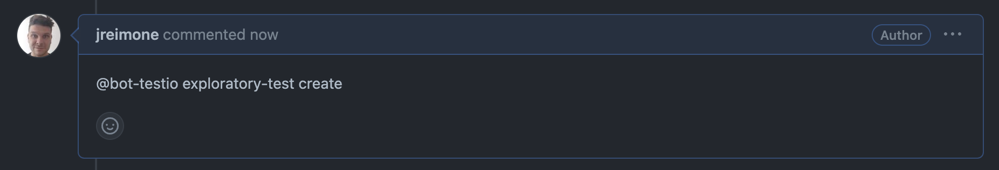
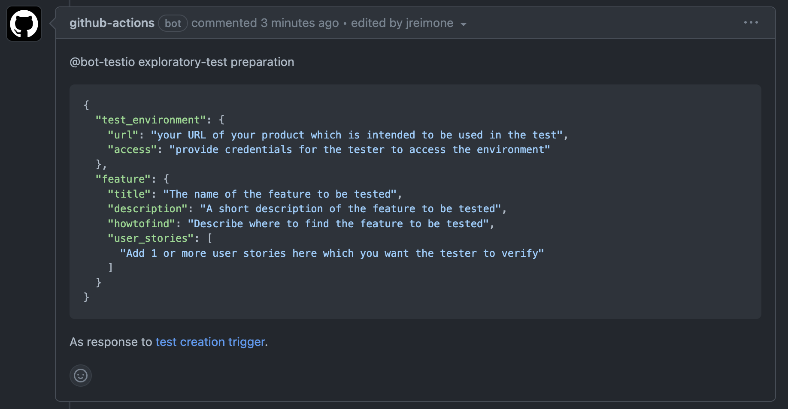
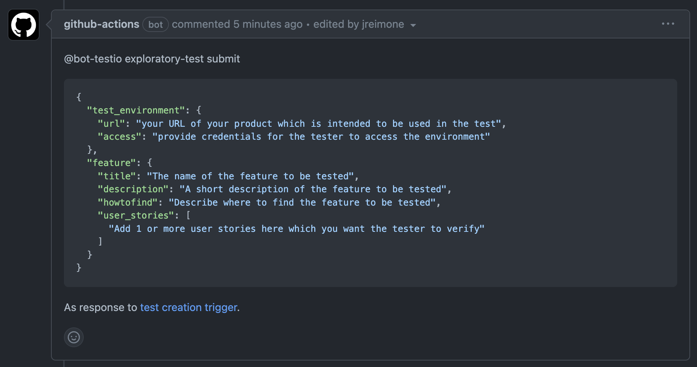
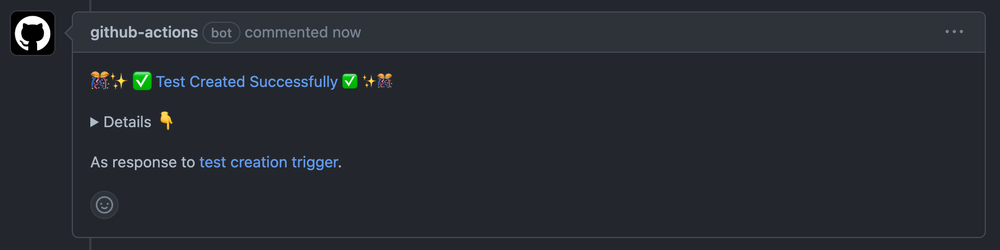
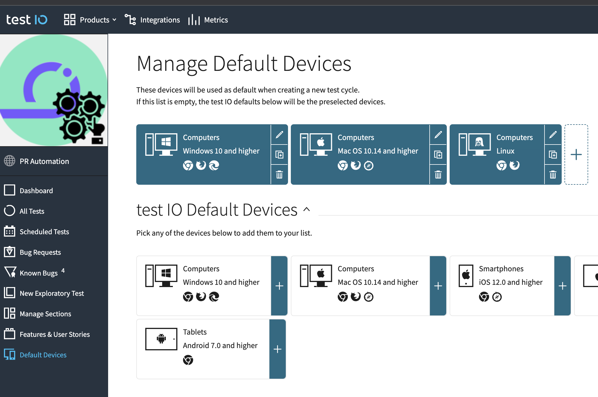

# Trigger a Test on the Crowd-Testing Platform TestIO from a Pull Request 

## Description

This GitHub Action can be used to trigger a new test on the external crowd-testing platform [TestIO](https://test.io/services/exploratory-testing) from a GitHub pull request (PR).
Once this action is available in your repository you can use it by adding and editing specific comments in any PR.

> ##### Note: For being able to use this action you need to be a customer of TestIO.

## Enable the Action in Your Repository 

To enable the action in your repository we recommend adding a new workflow to the `.github/workflows` folder.
It must look like the following workflow. 

### Workflow

```yaml
name: TestIO - Trigger test from PR
on:
   issue_comment:
      types: [created, edited]

jobs:
  testio-trigger-test:

    name: TestIO - Trigger Test
    runs-on: ubuntu-22.04
    if: startsWith(github.event.comment.body, '@bot-testio exploratory-test')     # this is the prefix all subsequent comments must start with

    steps:
      - name: Trigger Test on TestIO
        uses: Staffbase/testio-trigger-test-github-action@v1.0.3
        with:
          testio-slug: your-testio-slug
          testio-product-id: your-testio-product-id
          github-token: ${{ secrets.YOUR_GITHUB_TOKEN }}
          testio-token: ${{ secrets.YOUR_TESTIO_TOKEN }}
```

### Reusable Workflow

You can also use a reusable workflow to enable this action in your repository described here: [https://github.com/Staffbase/gha-workflows#testio](https://github.com/Staffbase/gha-workflows#testio)

### Inputs

| Input               | Description                                                  | Required                                                   |
| ------------------- | ------------------------------------------------------------ | ---------------------------------------------------------- |
| `testio-slug`       | the slug you received from TestIO                            | NO, but effectively YES because it defaults to `staffbase` |
| `testio-product-id` | ID of the product on the TestIO platform to which the triggered test should be assigned to | YES                                                        |
| `github-token`      | GitHub token to be used for commenting in a PR               | YES                                                        |
| `testio-token`      | TestIO token of a user for which the triggered test is created | YES                                                        |

## Use the Action to trigger a new test on TestIO from a PR

We highly recommend creating a separate product in your TestIO account dedicated to test creation from a PR.
This avoids interference with the tests in your main product(s). 
You can easily achieve that via the menu as can be seen in the following screenshot.



### For the Default Devices in Your Account

In the product you dedicate for triggering tests from PRs we recommend configuring the default devices so that 
they correspond to your required Desktop test environments. Refer to the [FAQs](#faqs) how to achieve this.

To trigger a test on TestIO for your default devices the following steps are required:

1. Add the comment `@bot-testio exploratory-test create` to the PR from which the test should be triggered.
   
2. The action acknowledges your intention to trigger a new test by commenting in the PR with a message for requesting required information:
   
3. Provide the required information by editing the comment added in step 2.
4. Once you entered all the required information in the edited comment you need to replace `@bot-testio exploratory-test preparation` by `@bot-testio exploratory-test submit`.
   
5. This triggers the test on TestIO and successful creation is commented back as a new comment.
   

### For Android Devices

To trigger a test on TestIO explicitly for Android devices the same steps as described for [Default Devices](#for-the-default-devices-in-your-account)
need to be followed but with the following small adjustment:

- The comment to be added to trigger the whole process from step 1 needs to be `@bot-testio exploratory-test create android`.
- In addition to the other requested information you now need to provide the following:
  ```json
  "native": {
    "android": {
      "min": 8,
      "max": 10
    }
  }
  ```
- You need to provide minimal and maximum Android version of devices the testers should use.
- Only `integer` values are allowed.
- `min` is mandatory and `max` optional.
- If `max` is not provided TestIO automatically sets it to `latest`.

## FAQs

<details>
<summary>How/Where to configure the default devices on TestIO?</summary>
Find the Default Devices in the menu as can be seen in the following screenshot.



</details>

## Contributing

Please read [CONTRIBUTING.md](CONTRIBUTING.md) for details on our code of conduct, and the process for submitting pull requests to us.

## License

This project is licensed under the Apache-2.0 License - see the [LICENSE.md](LICENSE) file for details.

<table>
  <tr>
    <td>
      
    </td>
    <td>
      <b>Staffbase GmbH</b>
      <br />Staffbase is an internal communications platform built to revolutionize the way you work and unite your company. Staffbase is hiring: <a href="https://staffbase.com/jobs/" target="_blank" rel="noreferrer">staffbase.com/jobs</a>
      <br /><a href="https://github.com/Staffbase" target="_blank" rel="noreferrer">GitHub</a> | <a href="https://staffbase.com/" target="_blank" rel="noreferrer">Website</a> | <a href="https://staffbase.com/jobs/" target="_blank" rel="noreferrer">Jobs</a>
    </td>
  </tr>
</table>